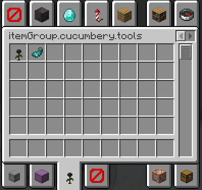
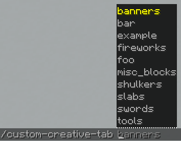

# CucumberyFabric
[FabricAPI](https://fabricmc.net/) 기반 마인크래프트 모드입니다.

## 주요 기능
 - 커스텀 크리에이티브 탭
 - 블록 채광 쿨타임 삭제 기능
 - 엔더 상자 파괴 방지 기능
 - 도끼/삽 트롤링 방지 기능
## 이미지 및 상세
### 커스텀 크리에이티브 탭

  
명령어를 통해 크리에이티브 탭을 생성하고 아이템을 관리할 수 있습니다.  
`/custom-creative-tab <그룹ID> add` - 손에 든 아이템을 해당 그룹에 등록합니다.  
`/custom-creative-tab <그룹ID> remove [번호]` 해당 그룹에 있는 마지막 아이템 혹은 해당 번호에 대응하는 아이템을 제거합니다.
`/custom-creative-tab <그룹ID> load` - 파일로부터 해당 그룹 정보를 가져옵니다.  
`/custom-creative-tab <그룹ID> save` - 파일에 해당 그룹 정보를 저장합니다.  
`/view-item` - 손에 들고 있는 아이템의 클라이언트상의 NBT를 참조합니다.  
### 블록 채광 쿨타임 삭제 기능
마인크래프트에는 기본적으로 블록을 파괴할 경우 다음 블록을 파괴할 때까지 짧은 시간(약 0.25초)의 딜레이가 존재합니다.  
이 기능은 해당 딜레이를 없애줍니다.  
단축키를 지정하여 기능을 언제든지 전환할 수 있습니다.
### 엔더 상자 파괴 방지 기능
일반적인 상황에서 엔더 상자를 부술 경우 엔더 상자가 드롭되지 않습니다.  
엔더 상자를 드롭하기 위해서는 반드시 섬세한 손길이 부여된 도구로 부숴야 합니다.  
이 기능은 실수로 섬세한 손길이 없는 도구로 엔더 상자를 부수려고 시도할 때 행동을 막아줍니다.  
단축키를 지정하여 기능을 언제든지 전환할 수 있습니다.
### 도끼/삽 트롤링 방지 기능
일부 블록(나무 원목, 밀랍칠한 구리 블록, 잔디 블록 등)은 도끼나 삽을 들고 우클릭할 경우 다른 블록으로 변경됩니다.  
이 기능은 실수로 해당 블록을 우클릭하려고 시도할 때 행동을 막아줍니다.  
단축키를 지정하여 기능을 언제든지 전환할 수 있습니다.